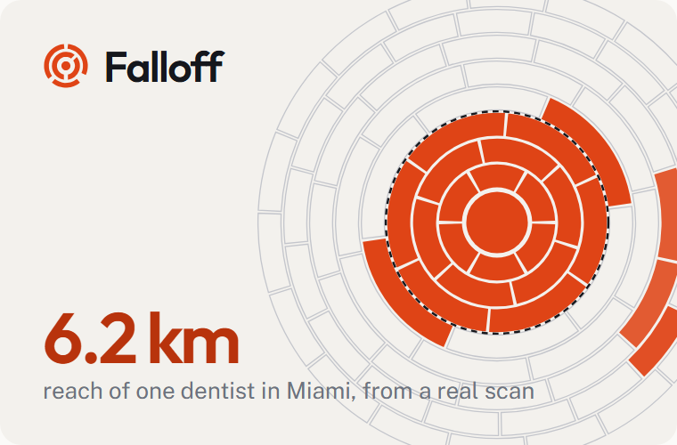
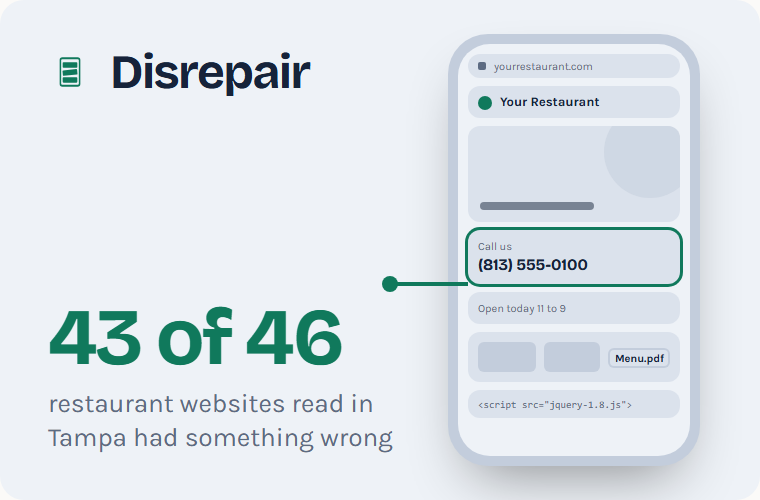

<picture>
  <source media="(prefers-color-scheme: dark)" srcset="assets/banner-dark.png">
  
</picture>

 

I run [Studio O'Brien](https://studioobrien.com), a web design and local search studio in Shelby, North Carolina. We build websites for local businesses, and we build the tools that measure whether those businesses actually get found.

Most reporting in local search is a screenshot taken from the owner's own shop, where everything looks great. I would rather measure it properly and show the numbers, including the ones that are not flattering.

## Tools

<table>
  <tr>
    <td width="46%" valign="top">
      <a href="https://candyflex.github.io/falloff/">
        <picture>
          <source media="(prefers-color-scheme: dark)" srcset="assets/falloff-dark.png">
          
        </picture>
      </a>
    </td>
    <td valign="top">
      <h3><a href="https://github.com/CandyFlex/falloff">Falloff</a></h3>
      
Google shows different businesses depending on where the searcher is standing. Falloff runs one Google Maps search from many locations around a business and maps how far it gets seen, whether it makes the top three, and who shows up instead.

      

        <a href="https://candyflex.github.io/falloff/"><b>Website</b></a> &nbsp;·&nbsp;
        <a href="https://candyflex.github.io/falloff/case-study.html"><b>Case study</b></a> &nbsp;·&nbsp;
        <a href="https://github.com/CandyFlex/falloff"><b>Source</b></a>
      

      
<code>npx github:CandyFlex/falloff help</code>

    </td>
  </tr>
</table>

<table>
  <tr>
    <td width="46%" valign="top">
      <a href="https://candyflex.github.io/disrepair/">
        <picture>
          <source media="(prefers-color-scheme: dark)" srcset="assets/disrepair-phone-dark.png">
          
        </picture>
      </a>
    </td>
    <td valign="top">
      <h3><a href="https://github.com/CandyFlex/disrepair">Disrepair</a></h3>
      
Name a town and a trade. Disrepair reads every listed business website once, politely, and shows which ones are failing their owners: a page that is gone, a number a caller cannot tap, a menu locked in a PDF. Every finding carries the measurement it rests on.

      

        <a href="https://candyflex.github.io/disrepair/"><b>Website</b></a> &nbsp;&middot;&nbsp;
        <a href="https://candyflex.github.io/disrepair/case-study.html"><b>Case study</b></a> &nbsp;&middot;&nbsp;
        <a href="https://github.com/CandyFlex/disrepair"><b>Source</b></a>
      

      
<code>npx github:CandyFlex/disrepair help</code>

    </td>
  </tr>
</table>

## How the work gets done

| Measure before advising | Numbers you can check | Plain language |
|---|---|---|
| A recommendation comes with the reading that produced it. | If a figure cannot be traced back and run again, it does not get published. | A business owner should be able to follow the whole argument without a glossary. |

## Find the studio

**[studioobrien.com](https://studioobrien.com)** &nbsp;·&nbsp; [The Field Guide](https://studioobrien.com/blog/), plain-language writing on local search and small business websites
