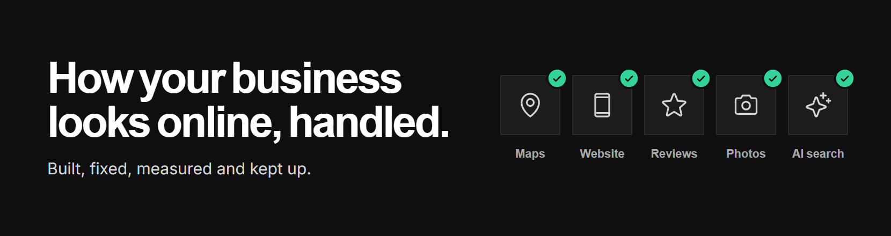
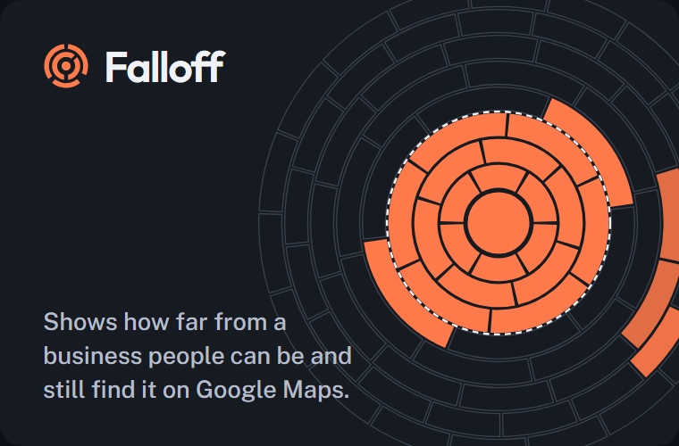
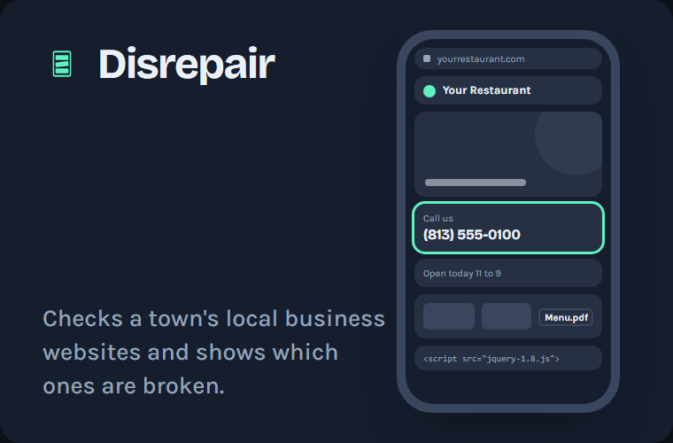
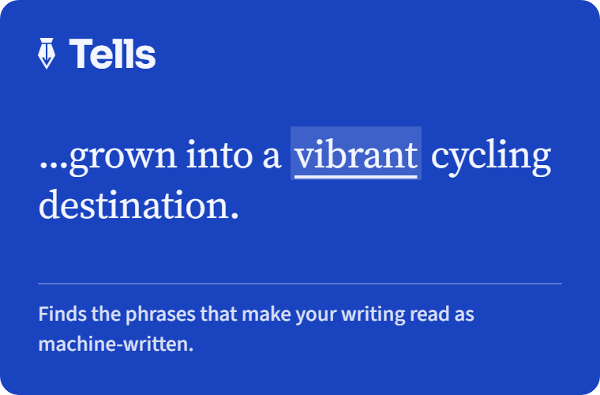

 

Before anyone calls a local business, they've already looked it up: the map listing, the photos, the reviews, the website on their phone, the answer an AI assistant gives. We take care of all of it, and measure what changes, so the owner can get back to the work.

The tools below are what we measure with. Free and open source.

## Tools

<table>
  <tr>
    <td width="46%" valign="top">
      
    </td>
    <td valign="top">
      <h3><a href="https://github.com/CandyFlex/falloff">Falloff</a></h3>
      
Google shows different businesses depending on where the searcher is standing. Falloff runs one Google Maps search from many locations around a business and maps how far it gets seen, whether it makes the top three, and who shows up instead.

      

        <a href="https://candyflex.github.io/falloff/"><b>Website</b></a> &nbsp;·&nbsp;
        <a href="https://candyflex.github.io/falloff/case-study.html"><b>Case study</b></a> &nbsp;·&nbsp;
        <a href="https://github.com/CandyFlex/falloff"><b>Source</b></a>
      

      
<code>npx github:CandyFlex/falloff</code>

    </td>
  </tr>
</table>

<table>
  <tr>
    <td width="46%" valign="top">
      
    </td>
    <td valign="top">
      <h3><a href="https://github.com/CandyFlex/disrepair">Disrepair</a></h3>
      
Name a town and a trade. Disrepair reads every listed business website once, politely, and shows which ones are failing their owners: a page that is gone, a number a caller cannot tap, a menu locked in a PDF. Every finding carries the measurement it rests on.

      

        <a href="https://candyflex.github.io/disrepair/"><b>Website</b></a> &nbsp;&middot;&nbsp;
        <a href="https://candyflex.github.io/disrepair/case-study.html"><b>Case study</b></a> &nbsp;&middot;&nbsp;
        <a href="https://github.com/CandyFlex/disrepair"><b>Source</b></a>
      

      
<code>npx github:CandyFlex/disrepair</code>

    </td>
  </tr>
</table>

<table>
  <tr>
    <td width="46%" valign="top">
      <a href="https://candyflex.github.io/tells/">
        <picture>
          <source media="(prefers-color-scheme: dark)" srcset="assets/tells-cobalt-dark.png">
          
        </picture>
      </a>
    </td>
    <td valign="top">
      <h3><a href="https://github.com/CandyFlex/tells">Tells</a></h3>
      
Paste in a draft and Tells marks the phrases that read as machine-written, each with the pattern it matched and the line and column where it sits. It gives no score and no verdict on who wrote it. It shows you where to start editing.

      

        <a href="https://candyflex.github.io/tells/"><b>Website</b></a> &nbsp;&middot;&nbsp;
        <a href="https://candyflex.github.io/tells/rules.html"><b>Rules</b></a> &nbsp;&middot;&nbsp;
        <a href="https://github.com/CandyFlex/tells"><b>Source</b></a>
      

      
<code>npx github:CandyFlex/tells</code>

    </td>
  </tr>
</table>

---

**[studioobrien.com](https://studioobrien.com)** &nbsp;·&nbsp; [The Field Guide](https://studioobrien.com/blog/)
